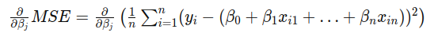

# Regression Techniques in Machine Learning

## Linear Regression for Bandgap Prediction

This repository contains a project focused on predicting the bandgap of molecules using linear regression. The project utilizes a dataset with four independent variables representing molecular properties to predict the bandgap (dependent variable).

## Objective

The objective is to apply linear regression techniques to understand the relationship between molecular properties and their bandgap values. This is a common problem in materials science, where understanding the electronic properties of materials is crucial for various applications.

## Dataset Description

The dataset used in this project includes the following features for each molecule:
- Four independent variables (floating-point numbers) representing different molecular properties.
- One dependent variable (floating-point number) representing the bandgap of the molecule.

## Theoretical Background

### Linear Regression

Linear regression is a statistical method used to model the relationship between a dependent variable and one or more independent variables. The model assumes a linear relationship between the variables, expressed as:

 y = &beta;0 + &beta;1x1 + &beta;2x2 + &hellip; + &beta;nxn

Where:
-  y  is the dependent variable (bandgap).
-  x1, x2, &hellip;, xn  are the independent variables (molecular properties).
-  &beta;0  is the intercept.
-  &beta;1, &beta;2, &hellip;, &beta;n  are the coefficients of the independent variables.

### Loss Function

The loss function used in linear regression is the Mean Squared Error (MSE), which measures the average squared difference between the actual and predicted values:

 MSE = (1/n) &sum; (yi - &ycirc;i)2 

Where:
-  yi  is the actual value of the dependent variable for the  i -th observation.
-  &ycirc;i  is the predicted value of the dependent variable for the  i -th observation.
-  n  is the number of observations.

### Gradient Descent

To minimize the MSE and find the optimal coefficients ( &beta; ), we use gradient descent, an iterative optimization algorithm. The idea is to update the coefficients in the opposite direction of the gradient of the loss function with respect to the coefficients. The update rule for each coefficient  &beta;j  is:

Where:
-  &alpha;  is the learning rate, a small positive number that determines the step size.

### Derivative Calculation

The gradient of the MSE with respect to each coefficient  &beta;j  is calculated as follows:

This simplifies to:

The intercept term  &beta;0  is updated as:

Which simplifies to:

### Methodology

1. **Data Preprocessing:**
    - **Loading the Dataset:** The dataset is loaded from a text file.
    - **Splitting the Dataset:** The dataset is split into training and testing sets to evaluate the model's performance on unseen data.

2. **Linear Regression Model:**
    - **Implementing from Scratch:** A linear regression model is implemented from scratch without using inbuilt functions, providing a deeper understanding of the underlying algorithm.
    - **Training the Model:** The model is trained using the training dataset, where the optimal coefficients ( &beta; ) are estimated by minimizing the Mean Squared Error (MSE) using gradient descent.
    - **Making Predictions:** The model makes predictions on the testing dataset based on the learned coefficients.

3. **Evaluation:**
    - **Performance Metrics:** The model's performance is evaluated using metrics such as Mean Squared Error (MSE) and R-squared ( R^2 ):

     

    - **Visualization:** The predicted bandgap values are compared with the actual values through visualizations.

The parity plot obtained is as follows:

# Logistic Regression 

This repository also implements logistic regression from scratch. The objective is to gain a deep understanding of the logistic regression algorithm by using numpy and other math libraries.

## Introduction
Logistic regression is a fundamental machine learning algorithm used for binary classification tasks. It models the probability that a given input belongs to a particular class. The logistic function (also known as the sigmoid function) is used to map predicted values to probabilities.

## Theory
### Logistic Function
The logistic function is defined as:

&sigma;(z) = 1&frasl;1 + e-z

where <sigma> z </sigma> is the input to the function. The output of the logistic function is always between 0 and 1, making it suitable for binary classification.

### Cost Function
The cost function for logistic regression is the log-loss (cross-entropy loss):

J(&theta;) = -1&frasl;m &sum;i=1m [ y(i) log(h&theta;(x(i))) + (1 - y(i)) log(1 - h&theta;(x(i))) ]

where  m  is the number of training examples, y(i) is the true label, and h&theta;(x(i)) is the predicted probability.

### Gradient Descent
To minimize the cost function, we use gradient descent. The update rule for gradient descent is:

&theta; := &theta; - &alpha; &part; J(&theta;)&frasl;&part; &theta;

where &alpha; is the learning rate.

## Implementation
The implementation involves the following steps:
1. **Data Generation**: Using `make_blobs` from sklearn to create a synthetic dataset.
2. **Sigmoid Function**: Implementing the logistic (sigmoid) function.
3. **Cost Function**: Calculating the cost using the log-loss function.
4. **Gradient Descent**: Implementing gradient descent to optimize the parameters.
5. **Prediction**: Using the trained model to make predictions on new data.
6. **Evaluation**: Assessing the performance of the model using metrics like accuracy.

Below is the decision boundary obtained after training the logistic regression model:

